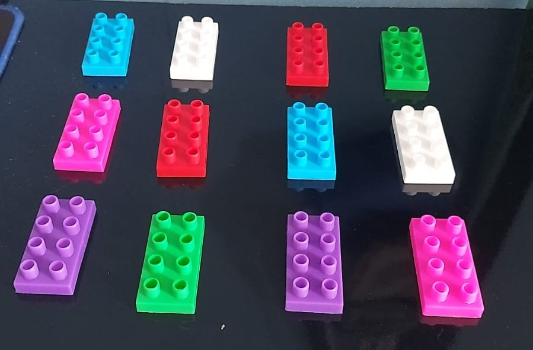
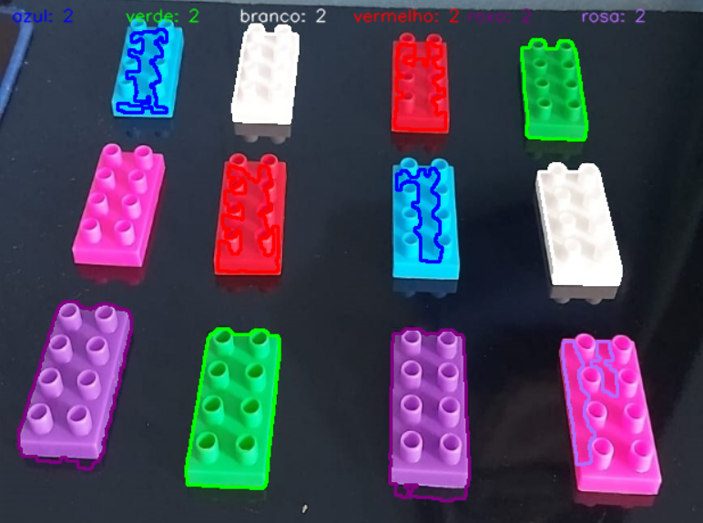

# processamento_objetos
Esse projeto processa a imagem de peças de lego e tem como objetivo segmentar os objetos da imagem e realizar a contagem.

## Imagens de Entrada

### Peças Lego

## Imagens de Saída

### Peças Lego

